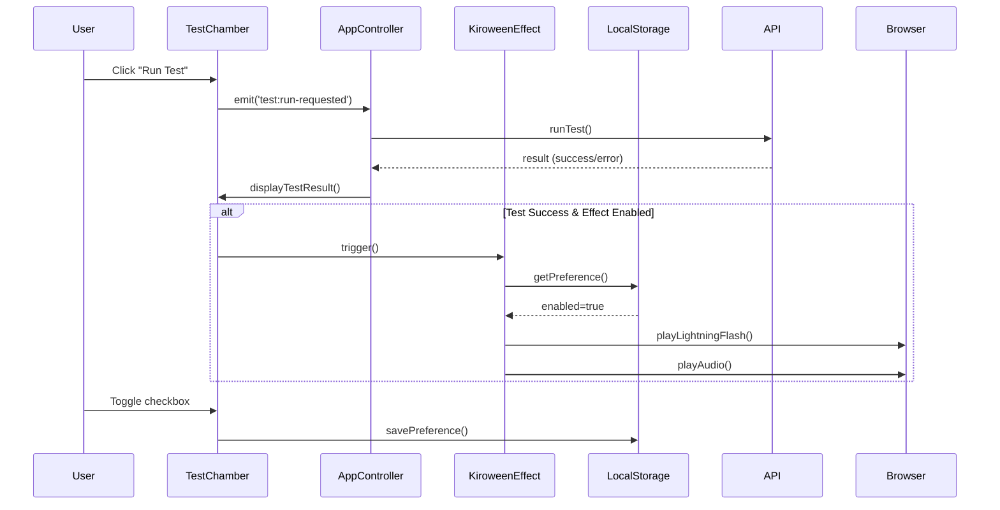

# Design Document

## Overview

The Kiroween Effect feature adds a celebratory visual and audio feedback mechanism to the Test Chamber interface. When a test run completes successfully, the interface will display a lightning flash animation, play a WAV audio file, and animate a floating ghost character across the header. Users can enable or disable this effect via a checkbox in the Test Chamber Parameters section.

This feature enhances user experience by providing immediate, engaging feedback for successful test completions, making the testing process more enjoyable and rewarding. The floating ghost animation adds a playful, whimsical element that travels across the header area, creating a sense of celebration and delight.

## Architecture

### Component Structure

The feature will be implemented as a new utility module (`KiroweenEffect.js`) that integrates with the existing Test Chamber Panel component. The architecture follows the existing event-driven pattern used throughout the application.

```
frontend/
├── js/
│   ├── components/
│   │   └── TestChamberPanel.js (modified)
│   ├── utils/
│   │   └── KiroweenEffect.js (new)
│   └── controllers/
│       └── AppController.js (modified)
├── assets/
│   └── audio/
│       └── kiroween.wav (new)
└── css/
    └── styles.css (modified)
```

### Event Flow



## Components and Interfaces

### 1. KiroweenEffect Utility Class

**Location:** `frontend/js/utils/KiroweenEffect.js`

**Purpose:** Manages the lightning flash animation, audio playback, and floating ghost animation

**Interface:**
```javascript
class KiroweenEffect {
    constructor()
    
    // Initialize the effect system
    init(): void
    
    // Check if effect is enabled
    isEnabled(): boolean
    
    // Set effect enabled state
    setEnabled(enabled: boolean): void
    
    // Trigger the effect (flash + audio + ghost)
    trigger(): void
    
    // Play lightning flash animation
    playLightningFlash(): void
    
    // Play audio file
    playAudio(): void
    
    // Load audio file
    loadAudio(): Promise<void>
    
    // Play floating ghost animation
    playFloatingGhost(): void
    
    // Create ghost element
    createGhostElement(): HTMLElement
    
    // Calculate ghost animation path
    calculateGhostPath(): {startX, midX, endX}
}
```

**Key Properties:**
- `storageKey`: 'prompt-laboratory-kiroween-enabled'
- `audioPath`: '/assets/audio/kiroween.wav'
- `ghostImagePath`: '/assets/images/kiro_monster_leftfacing.png'
- `flashDuration`: 1000ms (1 second)
- `ghostDuration`: 4000ms (4 seconds)
- `audioElement`: HTMLAudioElement instance
- `ghostElement`: HTMLImageElement instance

### 2. TestChamberPanel Modifications

**Location:** `frontend/js/components/TestChamberPanel.js`

**Changes:**
- Add checkbox element reference in constructor
- Add checkbox event listener in `setupEventListeners()`
- Import and initialize `KiroweenEffect` instance
- Trigger effect in `displayTestResult()` when successful
- Sync checkbox state with stored preference on init

**New Methods:**
```javascript
// Initialize Kiroween effect checkbox
initKiroweenCheckbox(): void

// Handle checkbox toggle
handleKiroweenToggle(event): void

// Check if test result indicates success
isTestSuccessful(result): boolean
```

### 3. AppController Modifications

**Location:** `frontend/js/controllers/AppController.js`

**Changes:**
- Modify `handleTestRunRequested()` to track test success/failure state
- Ensure error states are properly distinguished from success states

### 4. HTML Structure

**Location:** `frontend/index.html`

**Addition to Test Chamber Parameters:**
```html
<div class="parameter-group">
    <label class="parameter-checkbox-label kiroween-label">
        <input 
            type="checkbox" 
            id="kiroween-checkbox" 
            class="parameter-checkbox"
            aria-describedby="kiroween-help"
        >
        <span>Kiroween effect</span>
    </label>
    <div id="kiroween-help" class="help-text">
        Enable lightning flash and audio on successful test completion
    </div>
</div>
```

### 5. CSS Styles

**Location:** `frontend/css/styles.css`

**New Styles:**
```css
/* Kiroween Effect Styles */
.kiroween-flash-overlay {
    position: fixed;
    top: 0;
    left: 0;
    right: 0;
    bottom: 0;
    background: #9333EA; /* Purple lightning */
    pointer-events: none;
    z-index: 9999;
    opacity: 0;
}

.kiroween-flash-overlay.active {
    animation: lightningFlash 1s ease-out;
}

@keyframes lightningFlash {
    0% { opacity: 0; }
    10% { opacity: 0.9; }
    15% { opacity: 0.3; }
    25% { opacity: 0.95; }
    30% { opacity: 0; }
    40% { opacity: 0.8; }
    45% { opacity: 0; }
    100% { opacity: 0; }
}

/* Floating Ghost Animation */
.kiroween-ghost {
    position: fixed;
    height: 60px;
    width: auto;
    pointer-events: none;
    z-index: 10000;
    opacity: 0;
    top: 10px;
}

.kiroween-ghost.floating {
    animation: ghostFloat 4s ease-in-out forwards;
}

.kiroween-ghost.facing-right {
    transform: scaleX(-1);
}

.kiroween-ghost.facing-left {
    transform: scaleX(1);
}

.kiroween-ghost.front-layer {
    z-index: 10000;
}

.kiroween-ghost.back-layer {
    z-index: 1;
}

@keyframes ghostFloat {
    0% {
        opacity: 1;
        transform: translateX(var(--start-x)) translateY(0) scaleX(-1);
    }
    2%, 6%, 10%, 14%, 18%, 22%, 26%, 30%, 34%, 38%, 42%, 46% {
        transform: translateX(var(--current-x)) translateY(-3px) scaleX(var(--flip-x));
    }
    4%, 8%, 12%, 16%, 20%, 24%, 28%, 32%, 36%, 40%, 44%, 48% {
        transform: translateX(var(--current-x)) translateY(3px) scaleX(var(--flip-x));
    }
    50% {
        opacity: 1;
        transform: translateX(var(--mid-x)) translateY(0) scaleX(-1);
    }
    52%, 56%, 60%, 64%, 68%, 72%, 76%, 80%, 84%, 88%, 92%, 96% {
        transform: translateX(var(--current-x)) translateY(-3px) scaleX(var(--flip-x));
    }
    54%, 58%, 62%, 66%, 70%, 74%, 78%, 82%, 86%, 90%, 94%, 98% {
        transform: translateX(var(--current-x)) translateY(3px) scaleX(var(--flip-x));
    }
    87.5% {
        opacity: 1;
        transform: translateX(var(--end-x)) translateY(0) scaleX(1);
    }
    100% {
        opacity: 0;
        transform: translateX(var(--end-x)) translateY(0) scaleX(1);
    }
}

/* Dark mode support */
[data-theme="dark"] .kiroween-flash-overlay {
    background: #A855F7; /* Lighter purple for dark mode */
}

/* Checkbox styling */
.parameter-checkbox-label {
    display: flex;
    align-items: center;
    gap: 0.5rem;
    cursor: pointer;
    user-select: none;
}

.parameter-checkbox-label.kiroween-label {
    color: #9333EA; /* Purple text for Kiroween label */
    font-weight: 500;
}

[data-theme="dark"] .parameter-checkbox-label.kiroween-label {
    color: #A855F7; /* Lighter purple for dark mode */
}

.parameter-checkbox {
    width: 18px;
    height: 18px;
    cursor: pointer;
}
```

## Data Models

### Preference Storage

**Storage Key:** `prompt-laboratory-kiroween-enabled`

**Storage Type:** localStorage

**Data Format:**
```javascript
{
    enabled: boolean  // true or false
}
```

**Default Value:** `false` (disabled by default)

### Test Result Structure

The existing test result structure from the API is used to determine success:

```javascript
{
    response: string,           // AI response text
    yaml_config: string,        // YAML configuration
    execution_time: number,     // Time in seconds
    error?: string,            // Present if error occurred
    status?: string            // 'success' | 'error' | 'timeout'
}
```

**Success Criteria:**
- `result.response` is present and non-empty
- `result.error` is undefined or null
- No exception thrown during test execution

## Floating Ghost Animation Details

### Animation Sequence

The floating ghost animation follows a specific sequence:

1. **Initialization (0ms)**
   - Ghost element created with `kiro_monster_leftfacing.png` image
   - Positioned at the right edge of "Prompt-Laboratory" title
   - Horizontally flipped to face right (scaleX(-1))
   - Z-index set to 10000 (front layer, above "Ollama Connected" text)
   - Opacity set to 1

2. **Rightward Journey (0ms - 2000ms)**
   - Ghost moves from start position to settings gear icon
   - Floating motion: vertical oscillation of ±3px with 100ms intervals
   - Remains in front layer (z-index: 10000)
   - Maintains right-facing orientation

3. **Direction Change (2000ms)**
   - Ghost reaches settings gear icon
   - Horizontally flipped to face left (scaleX(1))
   - Z-index changed to 1 (back layer, behind "Ollama Connected" text)

4. **Leftward Journey (2000ms - 3500ms)**
   - Ghost moves from settings gear back to start position
   - Continues floating motion with vertical oscillation
   - Remains in back layer (z-index: 1)
   - Maintains left-facing orientation

5. **Fade Out (3500ms - 4000ms)**
   - Ghost opacity transitions from 1 to 0 over 500ms
   - Position remains at start location
   - Element removed from DOM after animation completes

### Position Calculation

The ghost positions are calculated dynamically based on header element positions:

```javascript
calculateGhostPath() {
    const titleElement = document.querySelector('.header-title'); // "Prompt-Laboratory"
    const gearElement = document.querySelector('.settings-icon'); // Settings gear
    
    const titleRect = titleElement.getBoundingClientRect();
    const gearRect = gearElement.getBoundingClientRect();
    
    return {
        startX: titleRect.right + 10, // 10px gap after title
        midX: gearRect.left - 70,     // Stop before gear (ghost width ~60px + 10px gap)
        endX: titleRect.right + 10    // Return to start position
    };
}
```

### Z-Index Layering

The ghost animation uses z-index changes to create the illusion of depth:

- **Front Layer (z-index: 10000)**: During rightward journey, ghost appears in front of "Ollama Connected" status
- **Back Layer (z-index: 1)**: During leftward journey, ghost appears behind "Ollama Connected" status
- **Header elements**: "Ollama Connected" status has z-index between 1 and 10000 (e.g., 100)

### Floating Motion

The floating effect is achieved through rapid vertical oscillation:

- **Oscillation amplitude**: ±3px
- **Oscillation frequency**: Every 100ms (alternating up/down)
- **Total oscillations**: ~40 over 4 second animation
- **Easing**: Smooth transitions between positions

### Image Flipping

Horizontal flipping is achieved using CSS transform:

- **Right-facing**: `transform: scaleX(-1)` (mirror image)
- **Left-facing**: `transform: scaleX(1)` (original orientation)
- **Flip timing**: Instantaneous at 2000ms mark

### Performance Optimization

- Ghost element created only when effect triggers (not persistent)
- CSS animations used for hardware acceleration
- Element removed from DOM after animation completes
- Image preloaded during KiroweenEffect initialization
- Single animation keyframe with CSS variables for positions

## Error Handling

### Audio Loading Failures

**Scenario:** Audio file fails to load or is not found

**Handling:**
- Log warning to console
- Continue with visual effect only
- Do not show error to user (graceful degradation)

**Implementation:**
```javascript
try {
    await this.loadAudio();
} catch (error) {
    console.warn('Kiroween audio failed to load:', error);
    this.audioAvailable = false;
}
```

### Audio Playback Failures

**Scenario:** Browser blocks audio playback (autoplay policy)

**Handling:**
- Catch playback promise rejection
- Log warning to console
- Continue with visual effect only

**Implementation:**
```javascript
try {
    await this.audioElement.play();
} catch (error) {
    console.warn('Kiroween audio playback blocked:', error);
}
```

### Animation Performance

**Scenario:** Animation causes performance issues on low-end devices

**Handling:**
- Use CSS animations (hardware accelerated)
- Respect `prefers-reduced-motion` media query
- Keep animation duration short (1 second)

**Implementation:**
```css
@media (prefers-reduced-motion: reduce) {
    .kiroween-flash-overlay.active {
        animation: none;
        background: #9333EA;
        opacity: 0.5;
        transition: opacity 0.3s ease;
    }
}
```

### LocalStorage Failures

**Scenario:** LocalStorage is unavailable or quota exceeded

**Handling:**
- Catch storage exceptions
- Fall back to in-memory state
- Default to disabled state

**Implementation:**
```javascript
setEnabled(enabled) {
    this.enabled = enabled;
    try {
        localStorage.setItem(this.storageKey, JSON.stringify({ enabled }));
    } catch (error) {
        console.warn('Failed to save Kiroween preference:', error);
    }
}
```

### Ghost Image Loading Failures

**Scenario:** Ghost image file fails to load or is not found

**Handling:**
- Log warning to console
- Continue with flash and audio effects only
- Do not show error to user (graceful degradation)

**Implementation:**
```javascript
createGhostElement() {
    const ghost = document.createElement('img');
    ghost.src = this.ghostImagePath;
    ghost.onerror = () => {
        console.warn('Kiroween ghost image failed to load');
        this.ghostAvailable = false;
    };
    return ghost;
}
```

### Header Element Not Found

**Scenario:** Required header elements (title, gear) are not present in DOM

**Handling:**
- Check for element existence before calculating positions
- Skip ghost animation if elements not found
- Continue with other effects (flash, audio)

**Implementation:**
```javascript
playFloatingGhost() {
    const titleElement = document.querySelector('.header-title');
    const gearElement = document.querySelector('.settings-icon');
    
    if (!titleElement || !gearElement) {
        console.warn('Header elements not found, skipping ghost animation');
        return;
    }
    
    // Continue with animation...
}
```

### Animation Overlap

**Scenario:** Effect triggered multiple times in rapid succession

**Handling:**
- Check if ghost animation is already running
- Skip new ghost animation if one is active
- Allow flash and audio to play normally

**Implementation:**
```javascript
playFloatingGhost() {
    if (this.ghostAnimating) {
        return; // Skip if already animating
    }
    
    this.ghostAnimating = true;
    // ... animation code ...
    
    setTimeout(() => {
        this.ghostAnimating = false;
    }, this.ghostDuration);
}
```

## Testing Strategy

### Manual Testing Checklist

1. **Checkbox Functionality**
   - Verify checkbox appears in Test Chamber Parameters
   - Verify checkbox state persists across page reloads
   - Verify checkbox can be toggled on/off

2. **Effect Triggering**
   - Run successful test with effect enabled → effect should trigger
   - Run successful test with effect disabled → no effect
   - Run failed test with effect enabled → no effect
   - Run test that times out with effect enabled → no effect

3. **Visual Effect**
   - Verify lightning flash animation plays
   - Verify animation completes in ~1 second
   - Verify animation doesn't interfere with result display
   - Test in light mode and dark mode

4. **Audio Effect**
   - Verify audio plays simultaneously with flash
   - Verify audio respects system volume
   - Verify audio doesn't block on autoplay restrictions
   - Test with audio file missing (graceful degradation)

5. **Ghost Animation**
   - Verify ghost appears and starts at correct position (after title)
   - Verify ghost is initially flipped to face right
   - Verify ghost moves rightward with floating motion
   - Verify ghost appears in front of "Ollama Connected" text during rightward journey
   - Verify ghost reaches settings gear and flips to face left
   - Verify ghost moves leftward with floating motion
   - Verify ghost appears behind "Ollama Connected" text during leftward journey
   - Verify ghost fades out smoothly at end position
   - Verify total animation duration is ~4 seconds
   - Test with ghost image missing (graceful degradation)
   - Test rapid test execution (ghost animation overlap prevention)

6. **Accessibility**
   - Verify checkbox is keyboard accessible
   - Verify checkbox has proper ARIA labels
   - Verify effect respects `prefers-reduced-motion`
   - Test with screen reader

7. **Browser Compatibility**
   - Test in Chrome/Edge
   - Test in Firefox
   - Test in Safari
   - Test on mobile browsers
   - Verify ghost animation performs smoothly across browsers

### Edge Cases

1. **Rapid Test Execution**
   - Run multiple tests quickly
   - Verify effects don't overlap or cause issues
   - Verify ghost animation skips if already running

2. **Tab Switching**
   - Start test, switch tabs, return
   - Verify effect still triggers appropriately

3. **Audio File Issues**
   - Remove audio file
   - Verify graceful degradation (visual only)

4. **Storage Quota**
   - Fill localStorage
   - Verify preference still works (in-memory fallback)

5. **Missing Header Elements**
   - Test with header elements not present
   - Verify ghost animation skips gracefully

6. **Window Resize During Animation**
   - Resize browser window while ghost is animating
   - Verify animation continues without breaking

### Performance Testing

1. **Animation Performance**
   - Monitor frame rate during flash animation
   - Monitor frame rate during ghost animation
   - Test on low-end devices
   - Verify no layout thrashing
   - Verify ghost animation uses hardware acceleration

2. **Audio Loading**
   - Verify audio loads asynchronously
   - Verify no blocking on page load
   - Test with slow network connection

3. **Ghost Image Loading**
   - Verify ghost image preloads during initialization
   - Verify no blocking on page load
   - Test with slow network connection

## Implementation Notes

### Audio File Selection

The audio file should be:
- Short duration (0.5-2 seconds)
- Thunder/lightning sound effect
- WAV format for broad compatibility
- Small file size (<100KB)
- Royalty-free or properly licensed

### Browser Compatibility

- **Audio:** Use HTML5 Audio API (supported in all modern browsers)
- **Animation:** Use CSS animations (hardware accelerated)
- **Storage:** Use localStorage with fallback
- **Minimum Browser Support:** Chrome 90+, Firefox 88+, Safari 14+, Edge 90+

### Accessibility Considerations

- Checkbox must be keyboard accessible (native input element)
- Proper ARIA labels for screen readers
- Respect `prefers-reduced-motion` for users with motion sensitivity (disable ghost animation)
- Audio should not be required for functionality (visual effects alone are sufficient)
- Ghost animation should not be required for functionality (flash and audio alone are sufficient)
- Help text explains what the effect does
- Ghost animation uses `pointer-events: none` to avoid blocking interaction

### Performance Considerations

- Audio file preloaded on init (async, non-blocking)
- Ghost image preloaded on init (async, non-blocking)
- CSS animations use `transform` and `opacity` (GPU accelerated)
- Flash overlay uses `pointer-events: none` to avoid blocking interaction
- Ghost element uses `pointer-events: none` to avoid blocking interaction
- Effect durations kept reasonable (flash: 1s, ghost: 4s) to avoid annoyance
- No JavaScript animation loops (pure CSS)
- Ghost element created on-demand and removed after animation
- Single CSS keyframe animation with CSS variables for dynamic positioning

## Future Enhancements

Potential future improvements (not in current scope):

1. **Customizable Effects**
   - Allow users to choose different sound effects
   - Allow users to customize flash color/pattern
   - Allow users to choose different ghost characters

2. **Effect Variations**
   - Different effects for different test outcomes
   - Intensity based on response time
   - Different ghost animations (flying, bouncing, etc.)

3. **Sound Volume Control**
   - Add volume slider in settings
   - Separate from system volume

4. **Additional Triggers**
   - Effect on prompt save
   - Effect on successful refinement

5. **Analytics**
   - Track effect usage
   - A/B testing for user engagement

6. **Ghost Animation Variations**
   - Multiple ghost paths (diagonal, circular, etc.)
   - Ghost leaves a trail effect
   - Multiple ghosts appearing simultaneously
   - Ghost interacts with other UI elements
